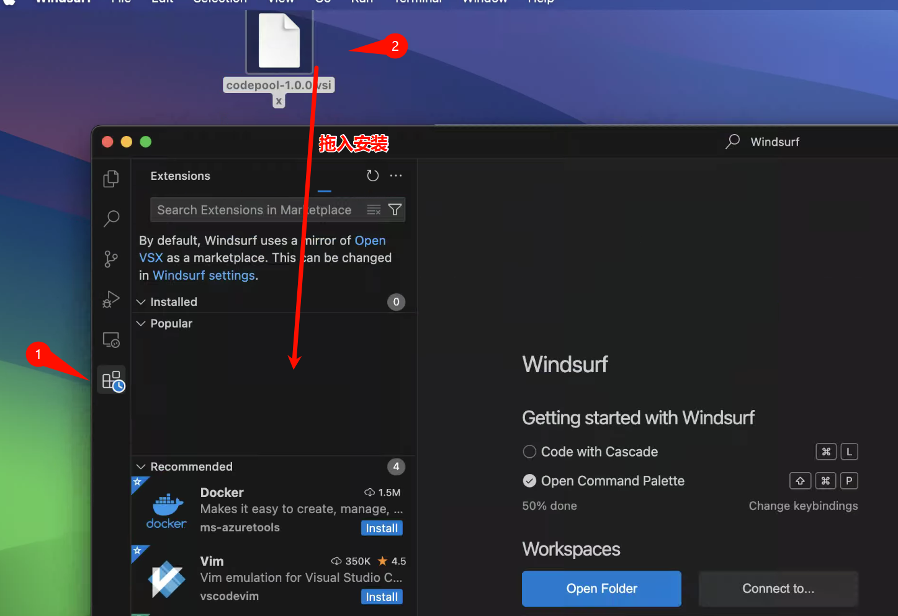
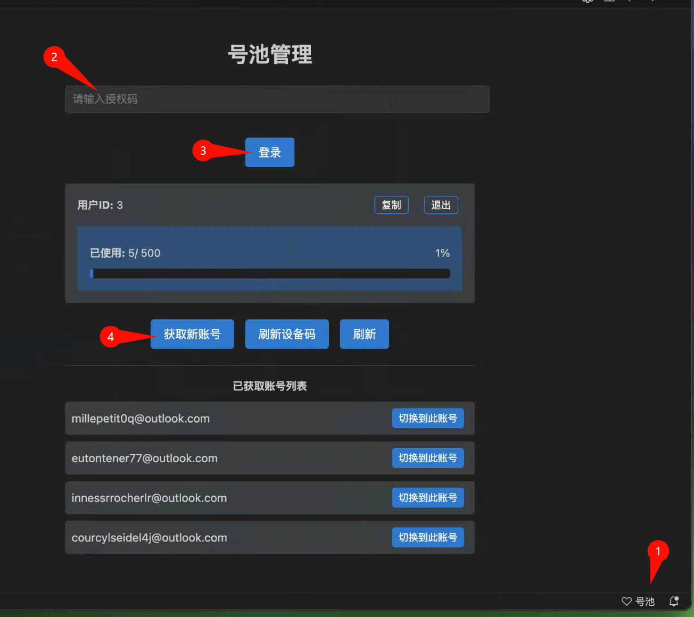
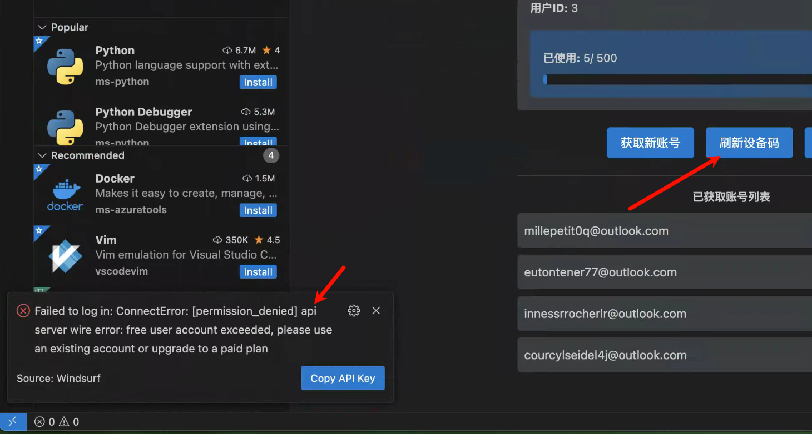

# windsurf-pool
windsurf号池插件, 一键换号, 解决free user account exceeded问题。已支持 augment

## 安装方法

1. 下载 [codepool-1.0.7.vsix](codepool-1.0.7.vsix) 文件
2. 在 windsurf 中打开扩展市场
3. 将 codepool-1.0.0.vsix 文件拖拽到 windsurf 的插件侧边栏

## 使用方法

1. 点击 windsurf 底部状态栏上的号池图标
2. 输入激活码
3. 点击登录
4. 点击获取新账号

## 提示 free user account exceeded 怎么办

1. 点击 windsurf 底部状态栏上的号池图标
2. 点击刷新设备码

## Linux 需要先修改文件权限

`sudo chown $(whoami) /usr/share/windsurf/resources/app/extensions/windsurf/dist/extension.js`

## 交流群

